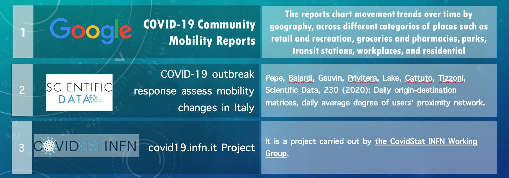
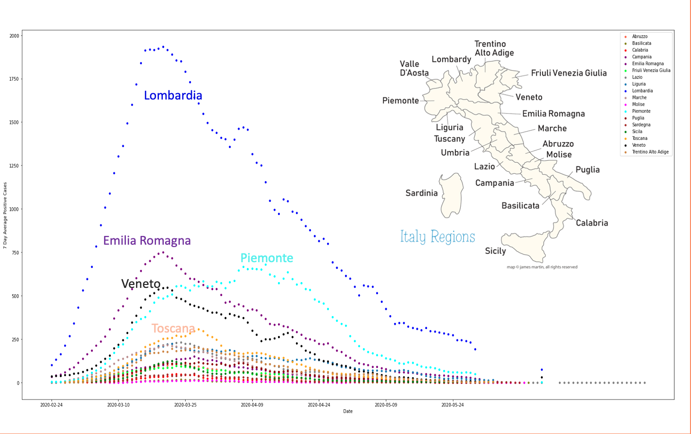
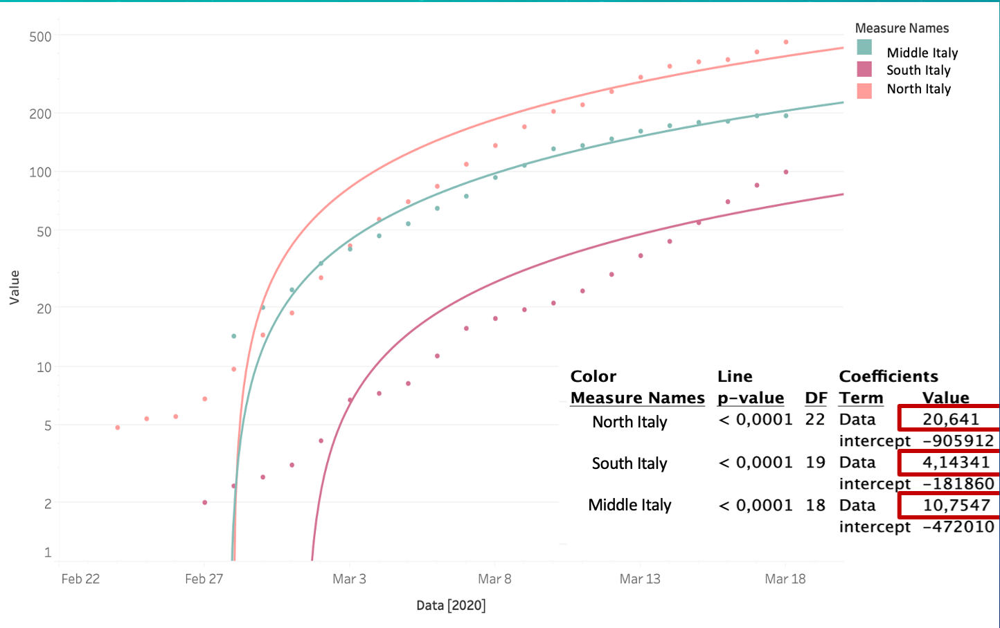
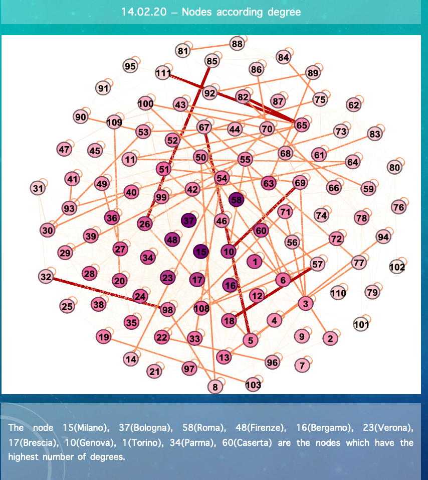
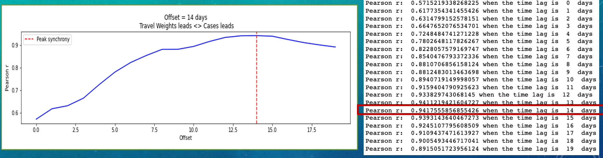
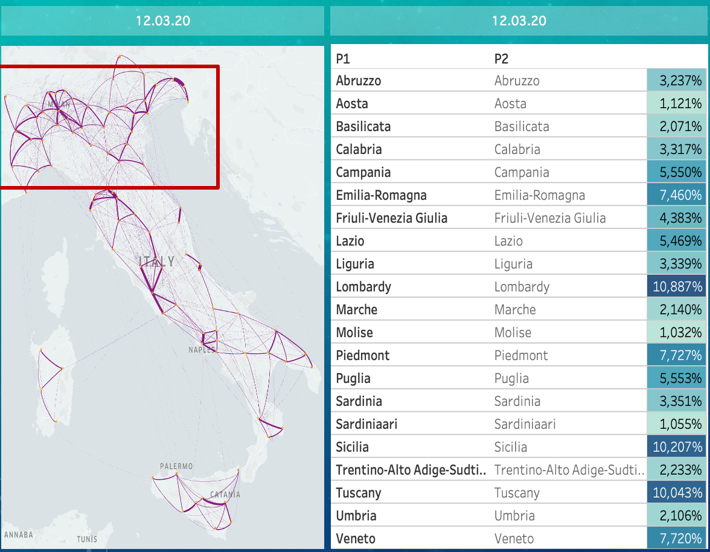
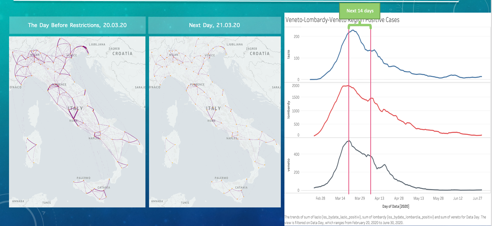
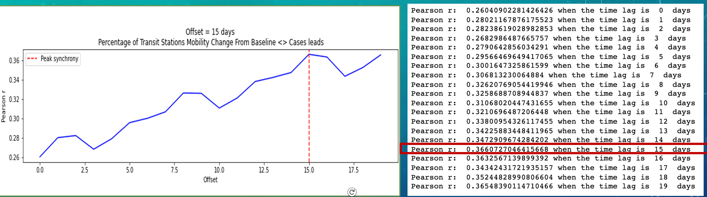
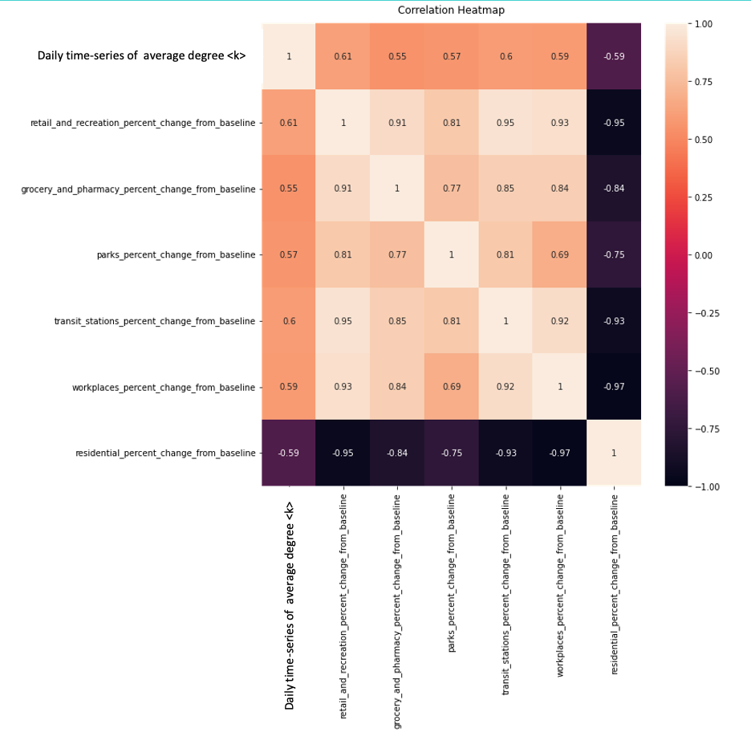
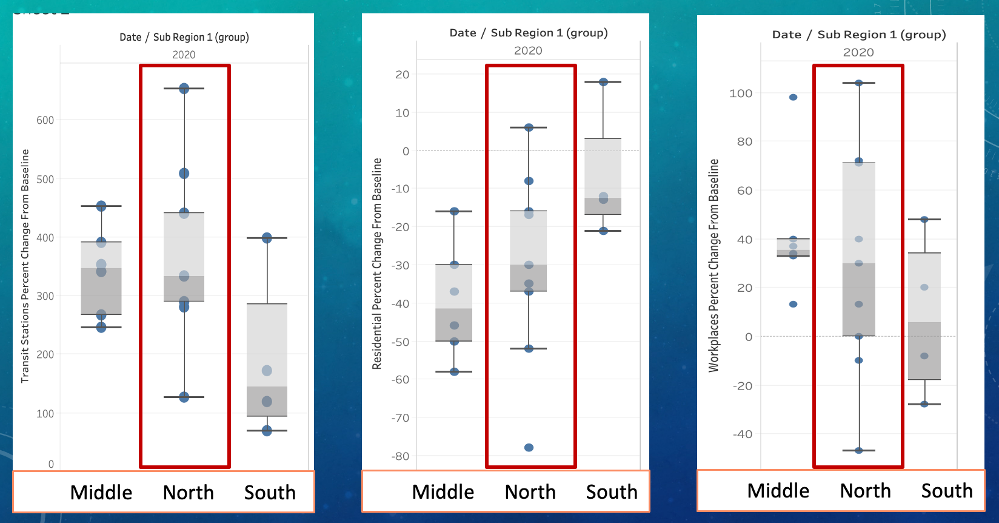

# COVID-19_In_Italy_Exploratory_Data_Analysis
This repository is created in order to analyze why COVID-19 spreading faster in North Italy when compared to other regions of Italy.
 
# Life Data Epidemiology

## Why North Italy has both faster dynamics of human mobility & variations and the speed of COVID-19 spreading compared to other regions in Italy.

In December 2019, the city of Wuhan(Hubei, China) experienced a cluster of pneumonia cases that were monitored by the Chinese health suthorities , and this was caused by the new COVID-19 pathogen. 
The global spread was so rapid that the WHO declared that the COVID-19 epidemic was a public health emergency on 30 January 2020.  As we all know at the very beginning of the disease, pandemics; we didn^t have vaccine, we didn’t have an extensive knowledge about the virus, how serious it is. 
Therefore, initially while  the researches about the virus continues, the only effective prevention methods are early detection and counter-measurements for the containment of the virus.

###### Objective

Our objective in this project is to understand how human mobility affects the spread of COVID-19 .  Does mobility limitation useful for controlling  COVID-19 spread ? Are variation in mobility related to variations in epidemic spreading potential or speed?
In this perspective,  we analyzed different data sources, made visualizations, statistical calculations , implemented correlation analysis, and we gathered the overall data analysis today here.

###### Purpose

Our objective in this project is to understand how human mobility affects the spread of COVID-19 .  Does mobility limitation useful for controlling  COVID-19 spread ? Are variation in mobility related to variations in epidemic spreading potential or speed?
In this perspective,  we analyzed different data sources, made visualizations, statistical calculations , implemented correlation analysis, and we gathered the overall data analysis today here.

###### Data Sources

In the data acquisation and exploration phase we take the fact that there are variety of ways to limit movements through diversified limitations and restrictions.  We tried to focus on the chronological development of the COVID-19 .  This means that we investigated the development of COVID-19 cases , type and limits of the restrictions, and human mobility  simultaneously.  The data that we use is listed here as below:
1. The Google COVID-19 Community Mobility Reports:  This data provides percentage change in movement trends over time by geography,  across  different categories of places such as: groceries, pharmacies, parks, transit stations, workplaces, and residential.
2.  The Apple Maps Mobility Trends Reports: This data reflects daily requests for directions in Apple Maps.
3. COVID-STAT-INFN Project: We import some data from this extensive project as basic reproductive rate with respect to date, and by type of the transportation.
4. The Scientific Data: We used an academic  paper which has the header ‘ COVID-19 outbreak response assess mobility changes in Italy. This paper provides three different types of data. Daily origin-destination matrices, daily average degree of users  proximity network.

The virus was first confirmed to have spread to Italy on 31 January 2020, when two Chinese tourists in Rome tested positive for the virus. 
One week later an Italian man repatriated back to Italy from the city of  Wuhan, China, was hospitalized and confirmed as the third case in Italy.
Clusters of cases were later detected in Lombardy and Veneto on 21 February, with the first deaths on 22 February. By the beginning of March, the virus had spread to all regions of Italy. 
First thing I would like to show you here is, How does the human mobility look like before the COVID-19 gain speed or larger momentum, I mean close to normal situation, a very ordinary day in Italy.  Why I would like to analyze this, understand this?
Because it will shed light on the knowledge of which cities have strong connections or relations with each other, and which cities are in danger when we have seen a cluster of cases in one city. From there, it allows us to estimate invasion risk,  and in more advance learn what are the conditions for a local outbreak to spread globally.  Understanding all of these properties makes spread management easier. 
Here on the board, we use a special data visualization technique which shows human mobility in the source and destination manner, the edge thickness have been designed according to the weights, I mean the fraction of travelling people from source to destination. Meaning that the thicker edges represents higher number of travelers, thus leads to more strong connections between source and destination.  
In the next few following pages, I’ll try to show you how we analyze the network in order to understand some specific properties of the network.  These numbers represents the Italian province codes. There are 4 different types of analysis we made, eigen-vector centrality, betweenness centrality, number of degrees and closeness centrality.

We make the following assumptions,

###### North Italy includes the following regions: Lombardia, Veneto, Trentino Alto Adige, Tuscany, Piemonte, Emiglia Romagnia, and Liguria. 

###### Middle Italy includes regions: Umbria, Marche, Sardegnia, Lazio, Abruzzo 

###### South Italy includes  regions: Puglia, Sicilia, Basilicata, Campania, Calabria and Molise. 

This graph shows the daily number of positive cases specific to each region. But in order the understand the epidemic is faster in the North Italy we should take the y-axis in the logarithmic scale. Because the intensity of cases depends on the population. It may also be named as normalization.

Before the pandemics gain speed and show an exponential increase in the daily number of positive cases, the cities in the north have generally the highest degrees and strong weights which shows the fraction of travelers between those.

###### LAG ANALYSIS BETWEEN WEIGHT IF FRACTION OF TRAVELLERS AND 7 DAY AVERAGE DAILY POSITIVE CASES 

Let’s see if there is a correlation between the human mobility and log scaled positive number of cases by applying lag analysis.

Notice that the correlation between the two time series becomes less and less positive as the number of lags increases, this tells us that human mobility during a given day is quite predictive of number of positive cases 14 days later, but not predictive of positive cases beyond more than 14 days. After the day 14, it started to decrease.

###### Average weıght of travellers fractıons by regıon – 14.02.20

We prefer to take the 12.03.0 as a reference date, because according to our calculation 14 days are needed for the peak synchrony. Therefore, the effects of mobility will be observable in terms of cases after 14 days. Origin Destination Matrix Fraction of Travelers Percentage of All Italy.

North Italy: 57,235%

South Italy: 27,73%

Middle Italy: 15,01%

12 Feb 2020, two weeks before the first cases have been detected, at the very beginning of the pandemics has the visualized weights of the fraction of travelers 
as shown in the Figure. The cities in the north are strongly connected with each other. 

Does this mobility cause the faster spreading of COVID-19 than in the other cities?

According to the above lag analysis let's see the effects on both Italy map and positive cases on the line graph.

Notice that the correlation between the two time series becomes less and less positive as the number of lags increases, this tells us that human mobility during a given day is quite predictive of number of positive cases 14 days later, but not predictive of positive cases beyond more than 14 days. After the day 14, it started to decrease.
You can see the obvious change in the human mobility on the map has decreased more obviously as the restrictions were tightened in the very next day 9’th of March. 
On the evening of 9 March, the quarantine measures were expanded to the entire country, coming into effect the next day. In a televised address, Conte explained that the moves would restrict travel to that necessary for work, and family emergencies, and that all sporting events would be cancelled. Italy was the first country to implement a national quarantine as a result of the COVID-19 pandemic.
Conte announced on 11 March that the lockdown would be tightened, with all commercial and retail businesses except those providing essential services, like grocery stores, food stores, and pharmacies, closed down. On 19 March, with over 35,000 confirmed cases and nearly 3,000 deaths from the disease.
On 21 March, Conte announced a further enlargement of the lockdown, by shutting down all non-necessary businesses and industries.
After the announcement of more enlarged and enlarged restrictions on 21’st of March, also it is the time when the positive number of cases reached their peak value. We started to see decrease in the number of positive cases as the time goes into the april.

Correlation analysis; Pearson’s correlation coefficient between time-series of mobility reductions reported by Google and daily time-series of average degree <k> of the proximity network. The time scale including the time 18.01.2020 and 27.03.20
Here we also calculated the Correlation analysis; and computed the Pearson’s correlation coefficients between time-series of mobility reductions reported by Google and daily time-series of average degree <k> of the proximity network. The time scale including the time 18.01.2020 and 27.03.20. We get the proximity network data from the scientific paper that we mentioned and matched according to the date(concatenation & join) operation on pandas python. 

###### VARIATIONS FROM THREE DIFFERENT PERspectıves between 15-02-2020 & 23-02-20, before the quarantıne

###### Conclusions

North Italy has both the highest dynamics of mobility and the covid-19 spreading. In this sense North Italy has the highest exponential factor when compared to other regions in Italy (according to the regions we compiled).

According to lag analysis there is a correlation between the human mobility and  daily number of covid-19 cases with  14 days  shift.

The average degree of the proximity network and variations in human mobility is highly correlated.

North Italy shows the highest rates also in the variations in human mobility.

